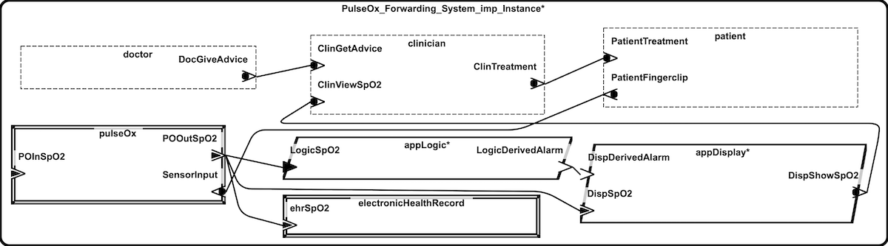

# The Pulse-Ox Forwarding Model

This is a model of a very simple medical application, designed to illustrate the Architecture-Supported Audit Processor (ASAP).

Full details can be found in the paper this example was designed for, "Architecture-Supported Audit Processor: Interactive, Query-Driven Assurance" (currently unpublished, contact the repository maintainer for a preprint). User-oriented documentation of the ASAP tool can be found in its [readme](https://github.com/osate/osate2-asap/blob/main/README.md)

An overview of the ASAP tool and its source code can be found in the project's [github repository](https://github.com/osate/osate2-asap).

## About the Model

This model consists of AADL and SAFE2 files describing a medical application which consists of the following elements:

* Patient -- A human at risk of hypoxemia
* Pulse Oximeter -- A medical device which measures a patient's blood-oxygen saturation (SpO2)
* App Logic -- Software which will trigger an alert if the SpO2 reading is below some value
* Display -- A hardware display which displays the current SpO2 reading and, if present, an alert
* Clinician -- A nurse monitoring the patient
* Doctor -- A doctor advising the clinician
* Electronic Health Record -- A database which stores historical SpO2 readings

The purpose of ASAP is to present safety-specific views of a system to an analyst. To that end, it has been partially analyzed using a process derived from the [Systematic Analysis of Faults and Errors](https://samprocter.com/safe) (SAFE). The information from that analysis is reflected in the AADL and SAFE2 files.

## Building the Example

After the project has been imported, there should not be any build errors. If there are, they can typically be removed by cleaning the project via `Project` > `Clean...` > `Clean`.

## Viewing ASAP's Representations

1. **Prerequisite:** Instantiate the System Implementation `PulseOx_Forwarding_System.imp` in `PulseOx_Forwarding_System.aadl`
2. **Containment Table:** Select the instance file (in the AADL Navigator view, it should be under `po-forwarding\aadl\instances`) then select the following options in the top menu bar: `Analyses > Safety > Component Containment Table`
3. **Fundamentals:** Select the safe2 file (in the AADL Navigator view, it should be under `po-fowarding`) then select the following options in the top menu bar: `Analyses > Safety > System Safety Fundamentals`
4. **Connected Neighbors:** Right click one of the components in the containment table, then `New > NewConnectedNeighbors`
5. **Unsafe Control Actions:** Select the instance file (in the AADL Navigator view, it should be under `po-forwarding\aadl\instances`) then select the following options in the top menu bar: `Analyses > Safety > Unsafe Control Action Table`
6. **Unsafe Control Actions, Refined:** Right click a cell with an X in it in the Unsafe Control Actions table, then `New > CreateUCA-Refinement`